Concepts fondamentaux et histoire des réseaux de neurones
=========================================================

Deep Learning : Kesako ?
------------------------

Un nouveau paradigme
^^^^^^^^^^^^^^^^^^^^

Certains problèmes peuvent être complexes à résoudre selon des approches classiques pilotées par des modèles / des équations.

Apparaît dans la 2ème moitié du XXème siècle un nouveau paradigme d'approche piloté par les données.

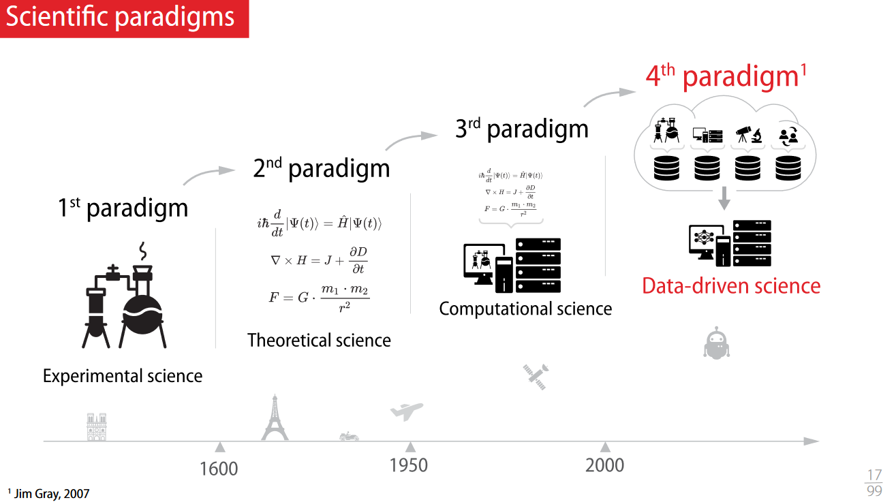

A noter que l'IA ne se limite pas au machine learning, qui lui même ne se limite pas au Deep Learning. A date cependant, on peut constater la répartition suivante :

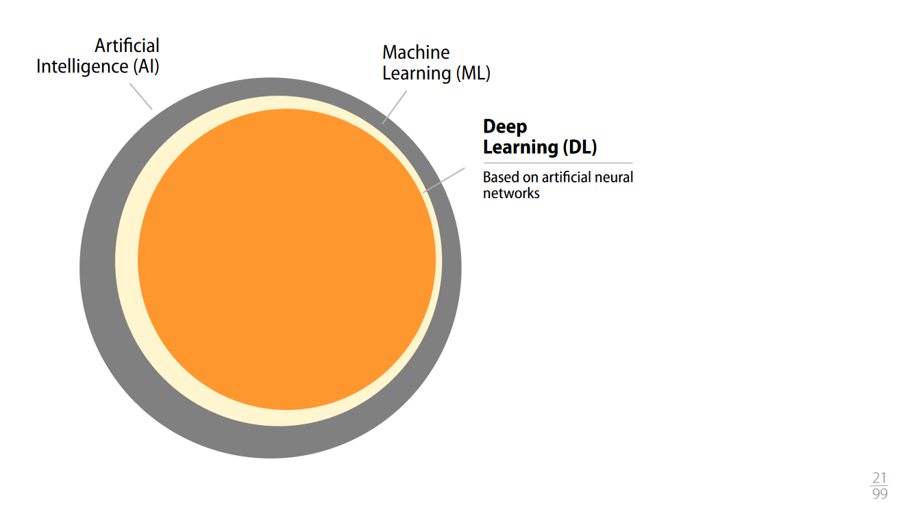

Peut être considéré comme intelligence artificielle ne correspond pas à du machine learning un logiciel de planification des personnels navigants dans l'aviation civile.
La "recherche opérationnelle" rentre dans cette catégorie, pas mal aboutie semble t il dans les années 80 90, encore largement utilisée semble t il.

.. note:: 
    Continuer à se renseigner sur ces derniers éléments.

Types d'apprentissage machine
^^^^^^^^^^^^^^^^^^^^^^^^^^^^^

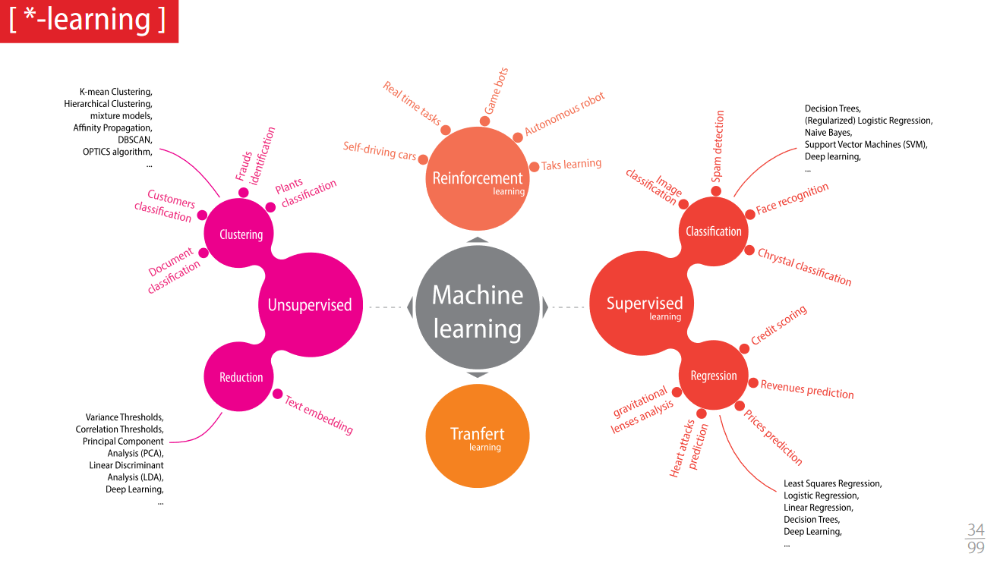

L' *"apprentissage supervisé"* est réalisé à partir de données labelisées. 

* Est par exemple possible de faire apprendre à un réseau de neurones à reconnaitre un animal sur des photos, auquel cas on est dans un cas de classification.
* Est aussi possible d'essayer de prédire le prix d'un logement à partir de données labelisées. On est alors dans le cas d'une régression.

L' *"apprentissage auto supervisé"* consiste à labeliser un petite partie des données, de déduire les labels des données non labelisées à partir de ce premier dataset, et par itération de disposer d'un réseau calibré 

L' *"apprentissage non supervisé"* consiste à travailler à partir de données non labelisées.

* On peut par exemple donner un jeu de données contenant des chats et des chiens sans les labeliser et faire déduire les critères au réseau de neurones. On parle alors de clustering.
* On peut aussi automatiser la réduction du nombre de dimensions sur un jeu de données.

.. note::
    Les apprentissages supervisé et auto supervisé semble être les méthodes les plus utilisées. Le non supervisé est lui utilisé quand il est complexe de disposer de données labelisées.

L' *"apprentissage par renforcement"* consiste à laisser l'IA interagir avec son environnement et programmer un certain nombre de récompenses pour calibrer le réseau.

Le *"transfert learning"* consiste à partir d'une compétence donnée acquise afin de faire acquérir au réseau une compétence complémentaire.

Outils
^^^^^^

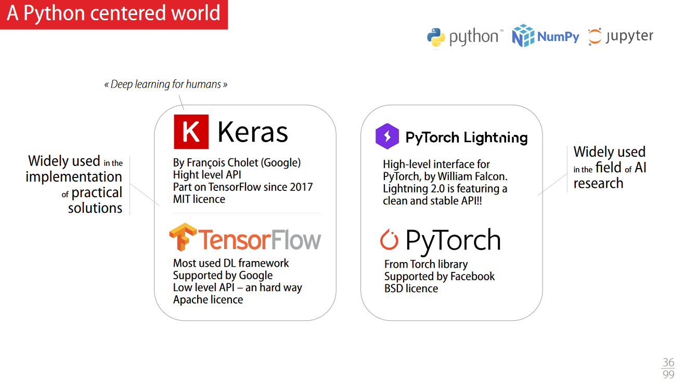

De la régression linéaire au neurone artificielle
-------------------------------------------------

Complexité de la régression linéaire et approche itérative
^^^^^^^^^^^^^^^^^^^^^^^^^^^^^^^^^^^^^^^^^^^^^^^^^^^^^^^^^^

Est possible de trouver les paramètres d'une régression linéaire directement via un formule fermée.

La complexité de cette opération est en n cube, ce qui fait que cette méthode est peu optimale sur un très grand nombre de points.

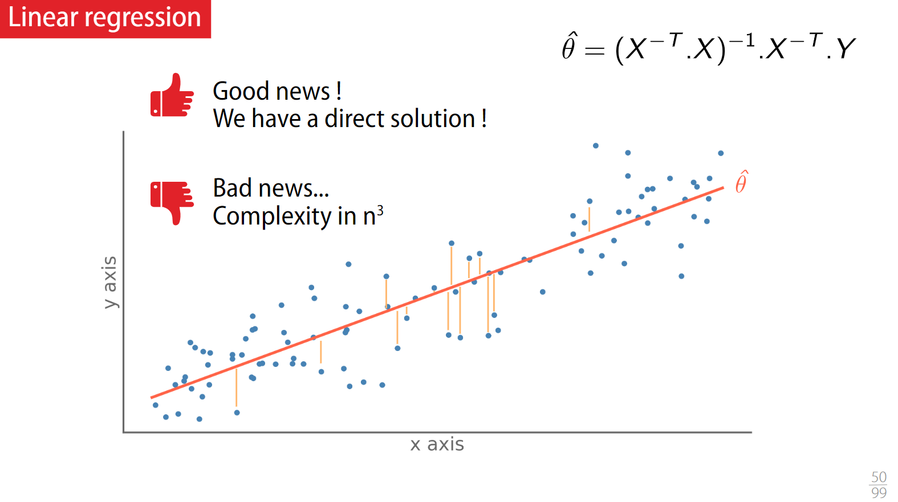

Est ainsi possible de procéder par un processus d'optimisation par itération, pour chaque itération de calculer l'erreur via le calcul de l'erreur quadratique moyenne (Root Mean Squared Error) ou la moyenne du carré des erreurs (Mean Squared Error).

L'objectif est donc de minimiser la fonction d'erreur (la loss) en raisonnant par gradient.

Il existe plusieurs algorithmes pour minimiser de la manière la plus efficiente possible, qui peut dépendre du contexte.

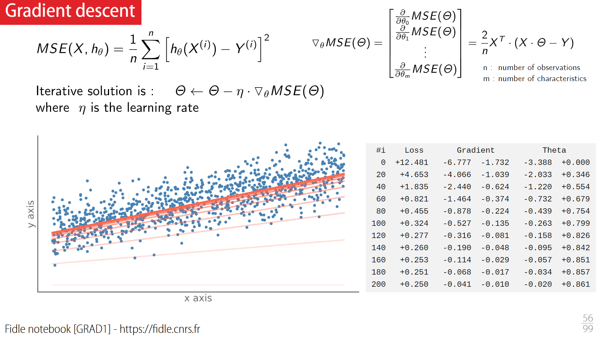

Régression polynomiale, underfitting et overfitting
^^^^^^^^^^^^^^^^^^^^^^^^^^^^^^^^^^^^^^^^^^^^^^^^^^^

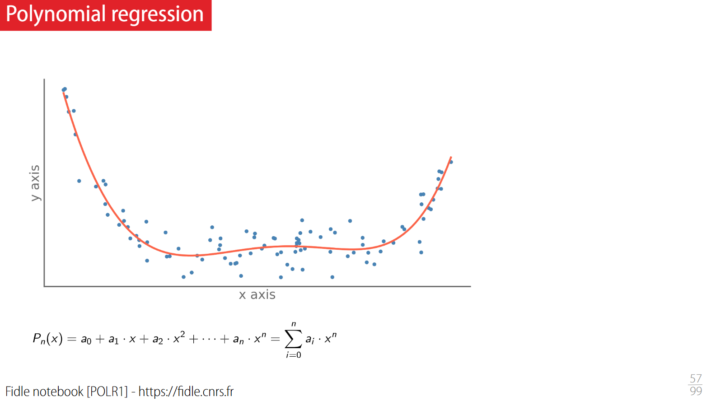

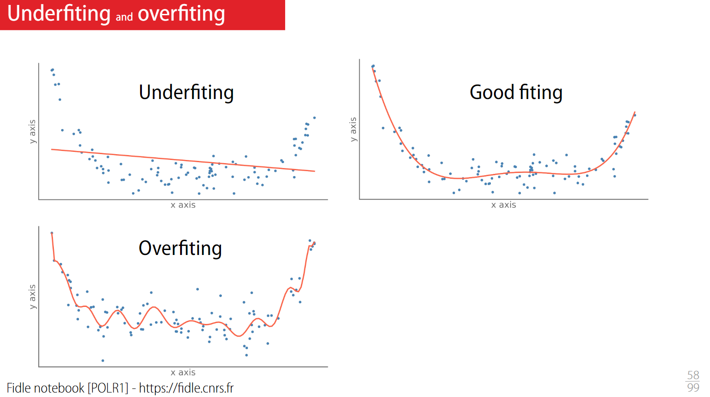

Neurone artificiel
^^^^^^^^^^^^^^^^^^

Le neurone artificiel se distingue de la régression linéraire de par une fonction d'activation, mais le principe est le même quant à l'optimisation des différents poids.

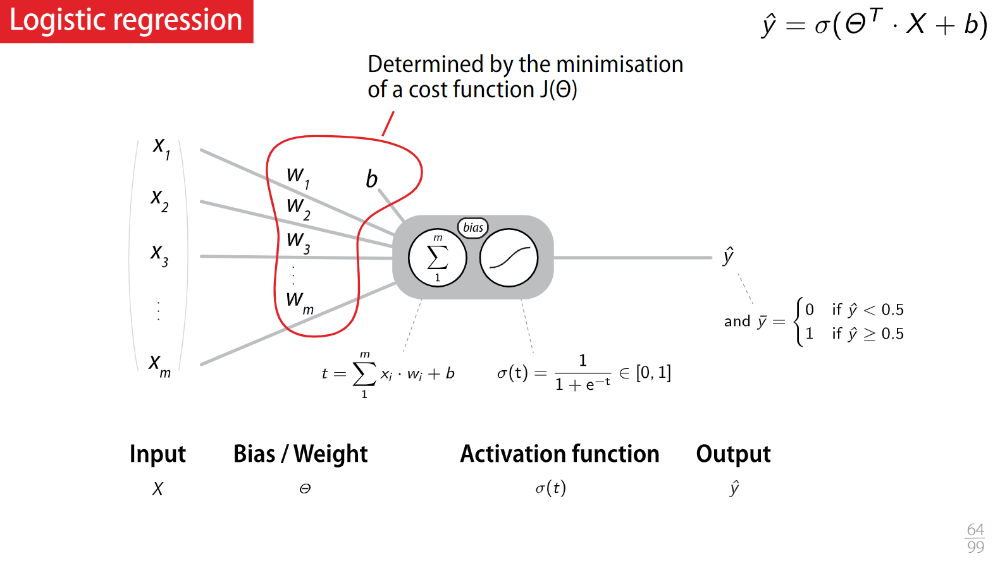

Histoire de l'intelligence artificielle
---------------------------------------

Définition de l'intelligence artificielle
^^^^^^^^^^^^^^^^^^^^^^^^^^^^^^^^^^^^^^^^^

Capacité de percevoir ou d'inférer l'information, et de la conserver comme une connaissance à appliquer à des comportements adaptatifs dans un environnement ou un contexte donné.

Connexionisme vs Symbolisme
^^^^^^^^^^^^^^^^^^^^^^^^^^^

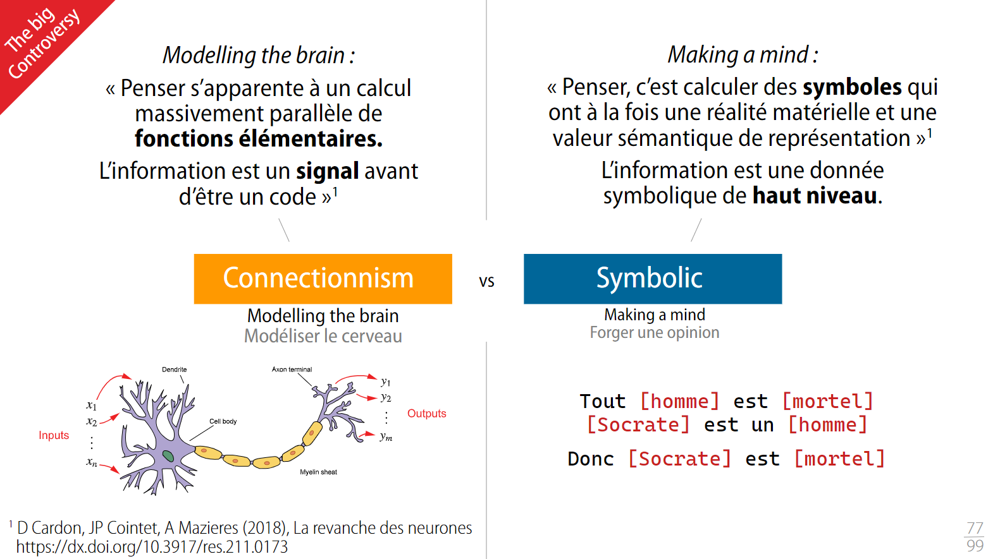

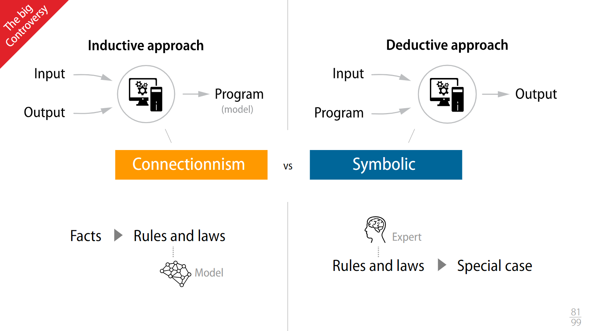

Histoire de l'intelligence artificielle
^^^^^^^^^^^^^^^^^^^^^^^^^^^^^^^^^^^^^^^

Jusqu'aux années 1960, les réseaux de neurones se développent via le monde académique. 

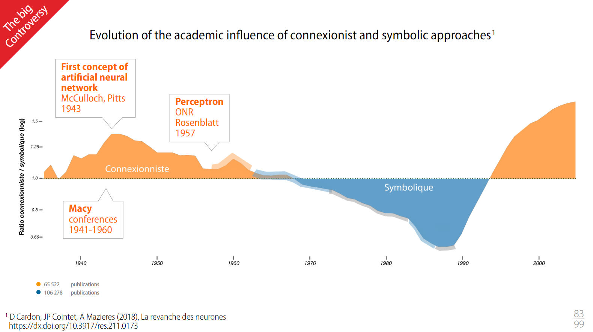

En 1957, Franck Rosenblatt décrit le Perceptron qui a un neurone qui est un classifier avec une fonction d'activation particulière, et ceci sur un dataset de 1936 nommé IRIS

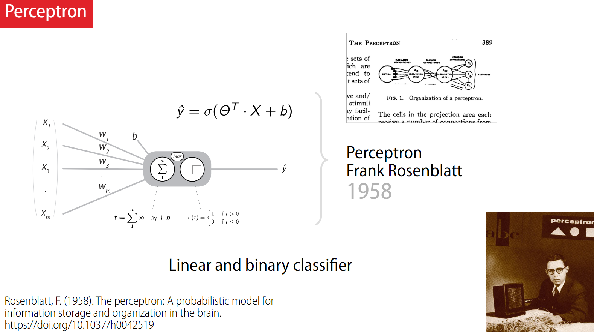

  Le terme "intelligence artificielle" est "inventé" à la conférence de Dortmund ? en 1960 ?

  En 1969, différents rapports parlementaires américains montrent que les résultats ne sont pas au niveau de ce qui a été promis. S'en suit le premier hiver de l'intelligence artificielle.

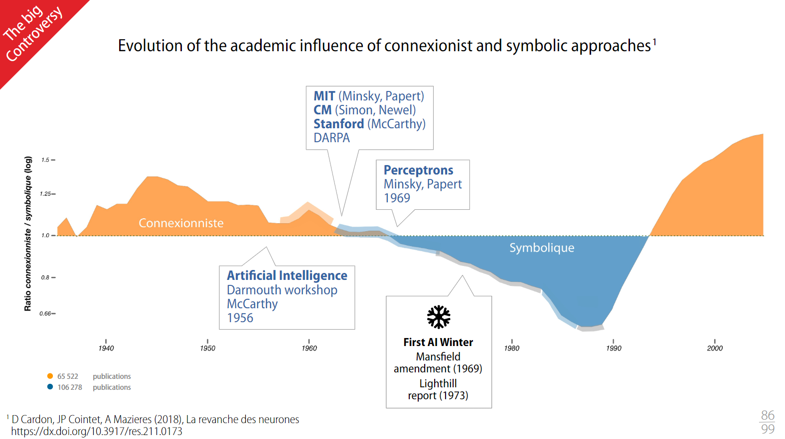

Différentes équipes continuent à travailler malgré tout sur ces thématiques, mais les systèmes experts deviennent majoritaires.

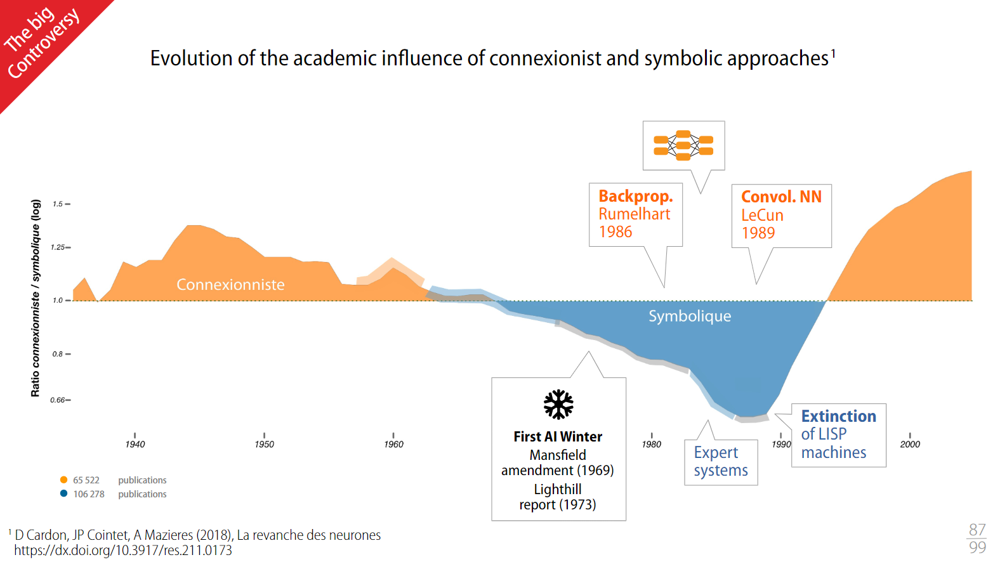

Rumelhart apporte en 1986 la capacité de calculer par rétropropagation les poids de l'ensemble des neurones dans un DNN.

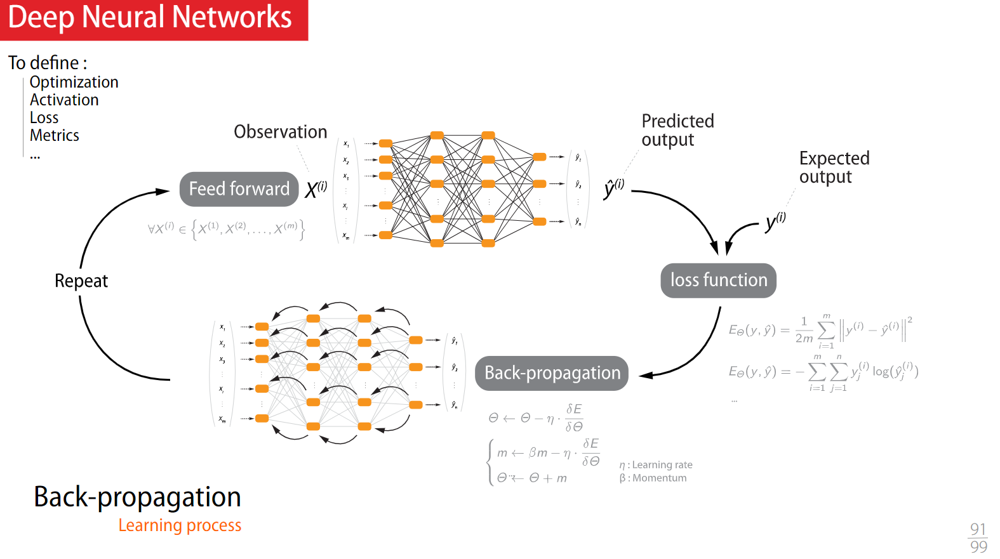

Dans les années 90, de nouveaux algorithmes d'optimisation voient le jour.

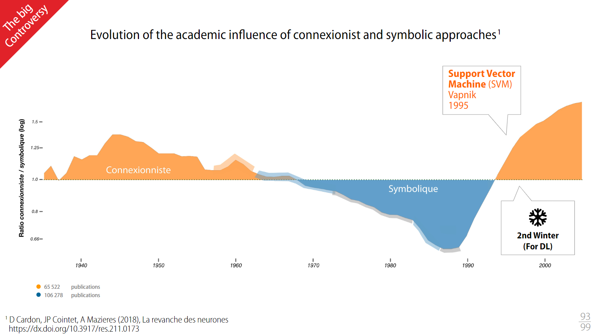

En 2012, AlexNet surclasse une compétition de classification d'images.

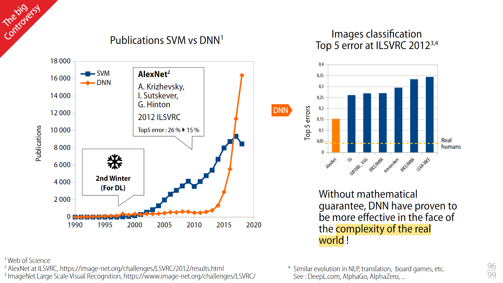

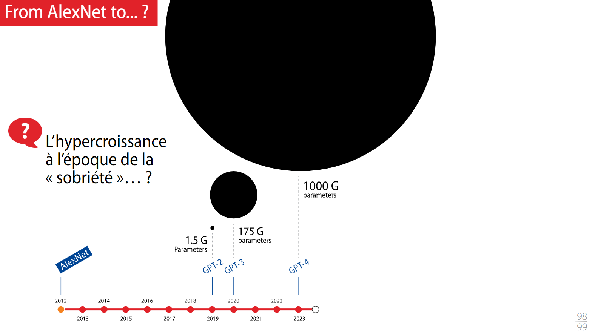

.. image:: History-10.png
  :width: 400
  :alt: History-09
